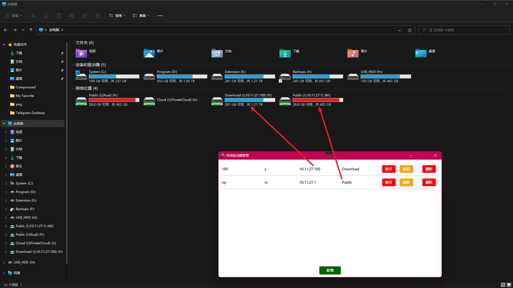

# 网络驱动器管理

## 发行版zip包在[gitee](https://gitee.com/liulei901112/NetDriveManage)下，[github](https://github.com/liulei901112/NetDriveManage)只是同步了代码

#### 软件介绍
用于管理windows共享和linuxsmb共享连接挂载到本地磁盘。主要目的帮助朋友解决已添加的共享连接服务端掉线，导致的资源管理器卡顿和崩溃的问题。通过这个软件管理配置信息，在需要的时候连接。不需要的时候断开，减少资源管理器打开的时候对网络驱动器的重连和验证问题。

#### 软件架构
使用.net wpf开发的单机软件

#### 安装教程
发行版zip包解压即用。

#### 使用说明

#### 参考文章
https://www.cnblogs.com/xuefei/p/4165480.html